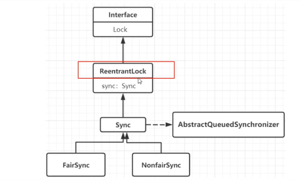
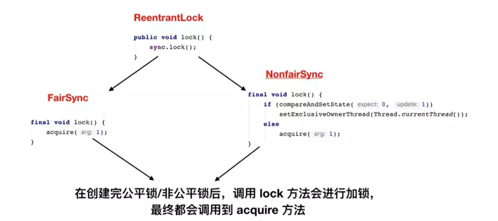
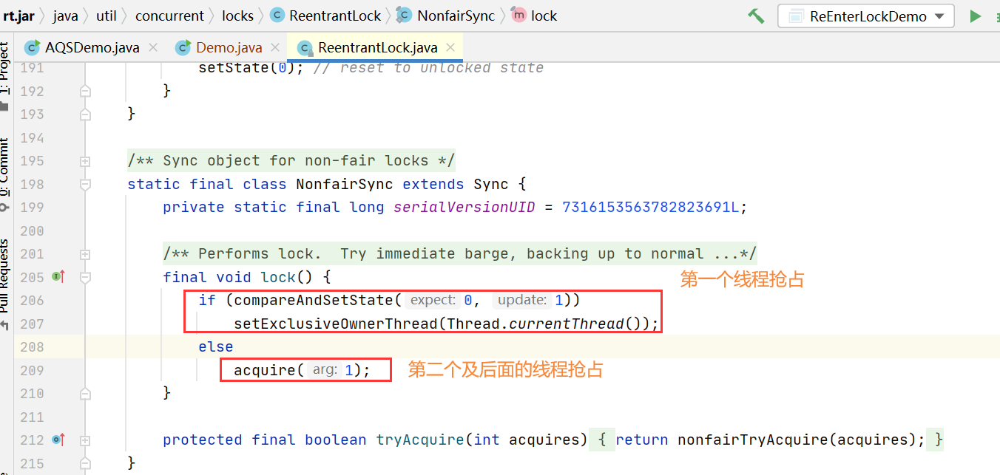
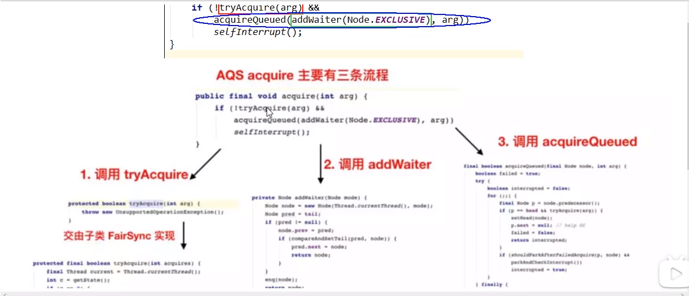
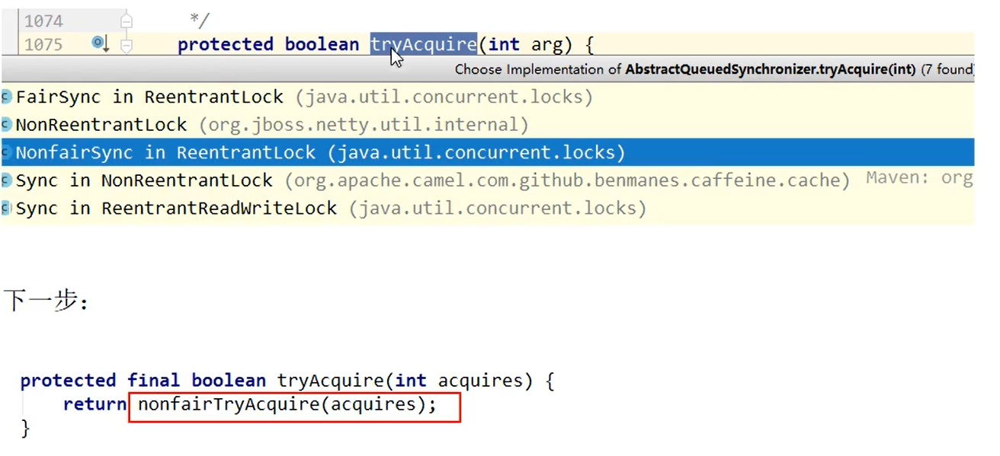
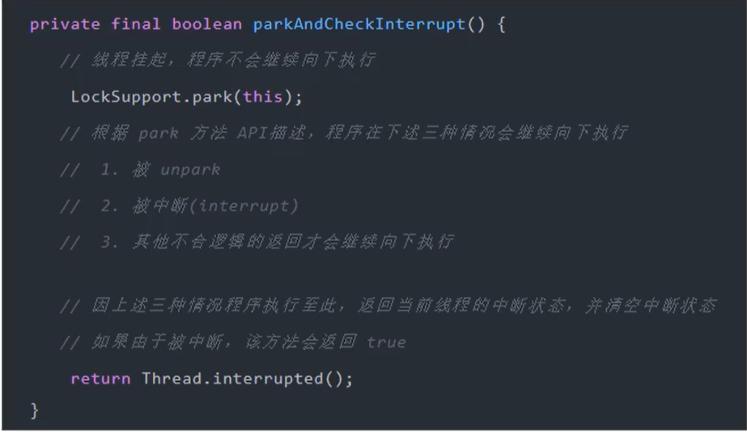

## 从ReentrantLock开始解读AQS

Lock接口的实现类，基本都是通过【聚合】了一个【队列同步器】的子类完成线程访问控制的

#### ReentrantLock的原理

#### 从最简单的lock方法开始看看公平和非公平

**可以明显看出公平锁和非公平锁的lock()方法唯一的区别就在于公平锁在获取同步状态时多了一个限制条件：hasQueuePredecessors()，hasQueuePredecessors是公平锁加锁时判断等待队列中是否存在有效结点的方法。**

#### 非公平锁走起，方法lock()

对比公平锁和非公平锁tryAcquire()方法的实现代码，其实差别就在于非公平锁获取锁时比公平锁少了一个判断!hasQueuedPredecessors()。

hasQueuedPredecessors()中判断了是否需要排队，导致了公平锁和非公平锁的差异如下：

**公平锁：**公平锁讲究先到先得，线程在获取锁时，如果这个锁的等待队列中已经有线程在等待，那么当前线程就会进入到等待队列中；

**非公平锁：**不管是否有等待队列，如果可以获取锁，则立即占有锁对象，也就是说队列的第一个线程在unpark()，之后还是需要竞争锁（存在线程竞争的情况下）

##### AQS源码深度分析

**lock()方法**

**acquire()方法**

源码和3大流程走向

**tryAcquire(arg)方法**

演示非公平锁

.jpg)

如果 return false ，则继续推进条件，走下一个方法addWaiter；如果return true，就直接结束。

**addWaiter(Node.EXCLUSIVE)方法**

方法.jpg)

enq(node)方法

方法.jpg)

双向链表中，第一个节点为虚节点(也叫哨兵节点)，其实并不存储任何信息，只是占位。真正的第一个有数据的结点，是从第二个结点开始的 。

假如下一个Thread线程进来，将会进行：

- prev
- compareAndSetTail
- next

#### acquireQueued(addWaiter(Node.EXCLUSIVE),arg)

acquireQueued（让线程入队，然后等待LockSupport进行park阻塞操作，执行到这一步才算是真正的入队成功了）

方法.jpg)

如果抢占失败，就进入到蓝色框框

shouldParkAfterFailedAcquire 和 parkAndCheckInterrupt方法中 

shouldParkAfterFailedAcquire 方法

.jpg)

.jpg)

如果前驱结点的waitStatus是SIGNAL状态，即shouldParkAfterFailedAcquire方法会返回true程序会继续向下执行 parkAndCheckInterrupt 方法，用于将当前线程挂起

parkAndCheckInterrupt方法

#### 方法unlock()

sync.release(1)  -> tryRelease(arg) -> unparkSuccessor

杀回马枪

