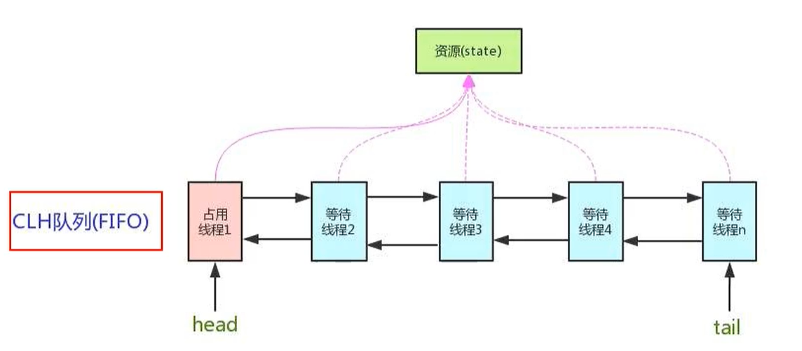
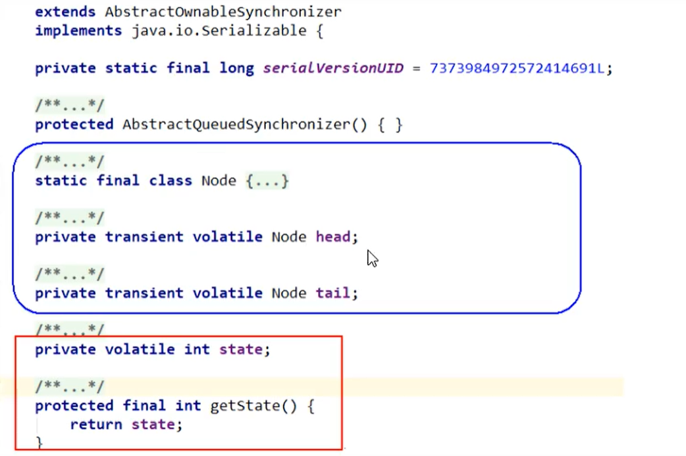

## AbstractQueueSynchronize之AQS

#### 前置知识

- 公平锁和非公平锁
- 可重入锁
- LockSupport
- 自旋锁
- 数据结构之链表
- 设计模式之模板设计模式

#### AQS是什么

字面意思 抽象队列同步器(AbstractQueueSynchronize)

源代码

·

AbstractOwnableSynchronizer
AbstractQueuedLongSynchronizer
AbstractQueuedSynchronizer

**通常地：AbstractQueuedSynchronizer简称为AQS**

技术解释

是用来构建锁或者其他同步器组件的**重量级框架及整个JUC体系的基石**，通过内置的FIFO**队列**来完成资源获取线程的队列工作，并通过一个**int类型变量**表示持有锁的状态。

#### AQS为什么是JUC内容中最重要的基石

和AQS有关的

- **ReentrantLock**

- **CountDownLatch**

- **ReentrantReadWriteLock**

- **Semaphore**

。。。

进一步理解锁和同步器的关系

锁，面向锁的**使用者**，定义了程序员和锁交互的使用层API，隐藏了实现细节，你调用即可。

同步器，面向锁的**实现者**，比如Java并发大神DougLee，提出统一规范并简化了锁的实现，屏蔽了同步状态管理、阻塞线程排队和通知、唤醒机制等。

#### 能干嘛

加锁会导致阻塞，有阻塞就需要排队等待，实现排队等待必然需要某种形式的队列来进行管理。

| 解释说明                                                     |
| ------------------------------------------------------------ |
| 抢到资源的线程直接使用处理业务逻辑，抢不到资源的必然涉及一种**排队等候机制**。抢占资源失败的线程继续去等待（类似银行业务办理窗口都满了，暂时没有受理窗口，**顾客只能去候客区等待**），但等候线程仍然保留获取锁的可能且获取锁流程仍在继续。  既然说到了**排队等候机制**，那么就一定会有某种队列形成，这样的队列是什么数据结构呢？  如果共享资源被占用，**就需要一定的阻塞等待唤醒机制来保证锁分配**。这个机制主要用的是CLH队列的变体实现的，将暂时获取不到的线程加入到队列中，这个队列就是AQS的抽象表现。它将请求共享资源的线程封装成队列的结（**Node**），通过CAS、自旋以及LockSupport.park()的方式，维护**state**变量的状态，使并发达到同步的控制效果。 |

#### AQS初识
 官网解释

有阻塞就需要排队，实现排队必须需要队列。AQS使用一个volatile的int类型的成员变量来表示同步状态，通过内置的FIFO队列来完成资源获取的排队工作将每条要去抢占资源的线程封装成一个Node结点来实现锁的分配，通过CAS完成对State值的修改。（代码如下图）

