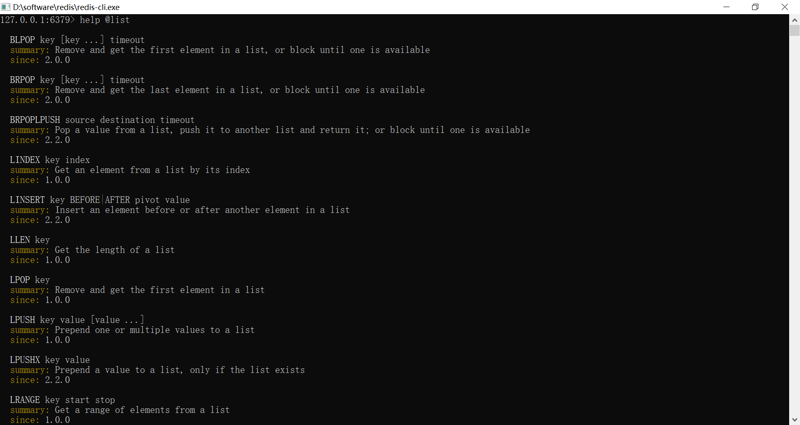

#### 安装redis6.0.8版本

官网地址：https://redis.io/

中文官网地址：http://redis.cn/

安全Bug按照官网提示，升级成为6.0.8


#### 官网命令大全网址(http://redis.cn/commands.html)

##### 8大类型

1. String(字符类型)
2. Hash(散列类型)
3. List(列表类型)
4. Set(集合类型)
5. SortedSet(有序集合类型，简称zset)
6. Bitmap(位图)
7. HyperLogLog(统计)
8. GEO(地理)

**备注：redis 命令是不区分大小写的 ，而key是区分大小写的**

```redis
set m1 n
set M1 N
是不一样的key值，因为redis区分大小写
```

不知道某个类型的使用方法时，我们可以使用redis的**help @方法**，不需要网络就可以查看此类型的使用方法




#### String

- 最常用：set key value / get key

- 同时设置/获取多个键值

  ```
  mset key value [key value ...]
  mget key [key]
  ```

- 数值递增

  ```
  递增数值
  INCR key
  增加指定的整数
  INCRBY key increment
  递减数值
  DECR key
  减少指定的整数
  DECRBY key decrement
  ```

- 截取字符串长度

  ```
  STRLEN key
  ```

- 分布式锁

  ```
  set key value [EX seconds] [PX millseconds] [NX|XX]
  EX:key在多少秒之后过期
  PX:key在多少毫秒之后过去
  NX:当key不存在的时候，才创建key，效果等同于setnx
  XX:当key存在的时候，覆盖key
  
  setnx key value
  set key value [EX seconds][PX millseconds][NX|XX]
  ```

- 应用场景

  1. 商品编号、订单号采用INCR命令生成
  2. 是否喜欢的文章

#### hash

Map<String, Map<Object,Object>>

- 一次设置一个字段

  ```
  HSET key field value
  ```

- 一次获取一个字段值

  ```
  HGET key field
  ```

- 一次设置多个字段值

  ```
  HMSET key field value [field value]
  ```

- 一次获取多个字段值

  ```
  HMGET key field [field...]
  ```

- 获取所有字段值

  ```
  HGETALL key
  ```

- 获取某个key内的全部数量

  ```
  hlen
  ```

- 删除一个key

  ```
  hdel
  ```

#### list 


