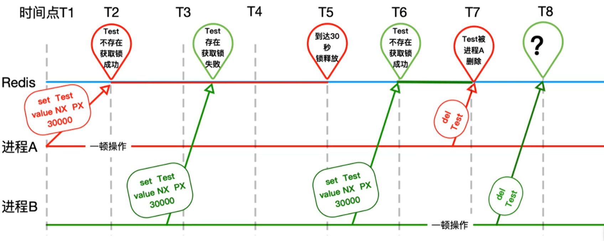

#### 问题一：单机版没有锁

在没有加锁的情况下，并发下商品剩余数不对，出现超卖的现象；

那么我们是应该加Synchronized还是加ReentrantLock还是都可以呢？

其实 Synchronized是java JVM层面的关键字，意味着**不见不散**，线程进来之后 ，如果程序不执行完毕，其他线程无法进入。

Lock lock = new ReentrantLock();

可以使用里面的lock.tryLock();或者lock.tryLock(Time)，到设置时间之后，锁自动释放，下一个线程进行抢占。

解决办法：将代码修改为2.0版本

```java
package com.romanticlei.redis.boot_redis02.controller;

import org.springframework.beans.factory.annotation.Autowired;
import org.springframework.beans.factory.annotation.Value;
import org.springframework.data.redis.core.StringRedisTemplate;
import org.springframework.web.bind.annotation.GetMapping;
import org.springframework.web.bind.annotation.RestController;

@RestController
public class GoodController {

    @Autowired
    private StringRedisTemplate stringRedisTemplate;

    @Value("${server.port}")
    private String serverPort;

    @GetMapping("/buy_goods")
    public String buy_Goods(){
        synchronized (this) {
            String result = stringRedisTemplate.opsForValue().get("goods:001");
            int goodNumber = result == null ? 0 : Integer.parseInt(result);

            if (goodNumber > 0){
                int realNumber = goodNumber - 1;
                stringRedisTemplate.opsForValue().set("goods:001", String.valueOf(realNumber));
                System.out.println("成功买到商品，库存还剩下： " + realNumber + "件" + "\t 服务提供端口" + serverPort);
                return "成功买到商品，库存还剩下： " + realNumber + "件" + "\t 服务提供端口" + serverPort;
            }

            return "商品已经售完"+ "\t 服务提供端口" + serverPort;
        }
    }
}
```

#### 问题二：nginx分布式微服务架构

分布式部署后，单机锁还是出现超卖现象,不管使用的是synchronized还是ReentrantLock都不管用，此时我们需要分布式锁,需要使用redis cluster


nginx配置负载均衡，启动两个微服务 ，开启压力测试，模拟高并发

解决办法：将代码修改为3.0版本，官网：https://redis.io/commands/set

```java
package com.romanticlei.redis.boot_redis01.controller;

import org.springframework.beans.factory.annotation.Autowired;
import org.springframework.beans.factory.annotation.Value;
import org.springframework.data.redis.core.StringRedisTemplate;
import org.springframework.web.bind.annotation.GetMapping;
import org.springframework.web.bind.annotation.RestController;

import java.util.UUID;

@RestController
public class GoodController {

    @Autowired
    private StringRedisTemplate stringRedisTemplate;

    public static String REDIS_LOCK = "romanticlei";

    @Value("${server.port}")
    private String serverPort;

    @GetMapping("/buy_goods")
    public String buy_Goods() {

        String value = UUID.randomUUID().toString() + Thread.currentThread().getName();
        Boolean flag = stringRedisTemplate.opsForValue().setIfAbsent(REDIS_LOCK, value);// 该命令就是redis中的setnx

        if (!flag) {
            return "抢占失败，请重试！";
        }

        String result = stringRedisTemplate.opsForValue().get("goods:001");
        int goodNumber = result == null ? 0 : Integer.parseInt(result);

        if (goodNumber > 0) {
            int realNumber = goodNumber - 1;
            stringRedisTemplate.opsForValue().set("goods:001", String.valueOf(realNumber));
            System.out.println("成功买到商品，库存还剩下： " + realNumber + "件" + "\t 服务提供端口" + serverPort);
            stringRedisTemplate.delete(REDIS_LOCK);
            return "成功买到商品，库存还剩下： " + realNumber + "件" + "\t 服务提供端口" + serverPort;
        }

        return "商品已经售完" + "\t 服务提供端口" + serverPort;
    }

}
```

#### 问题三：上面代码出现异常无法释放锁

上面代码出现异常的话 ，可能无法释放锁，必须要在代码层面finally释放锁

解决办法：加锁解锁，lock/unlock必须同时出现并保证调用，修改代码为4.0

```java
package com.romanticlei.redis.boot_redis01.controller;

import org.springframework.beans.factory.annotation.Autowired;
import org.springframework.beans.factory.annotation.Value;
import org.springframework.data.redis.core.StringRedisTemplate;
import org.springframework.web.bind.annotation.GetMapping;
import org.springframework.web.bind.annotation.RestController;

import java.util.UUID;

@RestController
public class GoodController {

    @Autowired
    private StringRedisTemplate stringRedisTemplate;

    public static String REDIS_LOCK = "romanticlei";

    @Value("${server.port}")
    private String serverPort;

    @GetMapping("/buy_goods")
    public String buy_Goods() {

        String value = UUID.randomUUID().toString() + Thread.currentThread().getName();
        try {
            Boolean flag = stringRedisTemplate.opsForValue().setIfAbsent(REDIS_LOCK, value);// 该命令就是redis中的setnx

            if (!flag) {
                return "抢占失败，请重试！";
            }

            String result = stringRedisTemplate.opsForValue().get("goods:001");
            int goodNumber = result == null ? 0 : Integer.parseInt(result);

            if (goodNumber > 0) {
                int realNumber = goodNumber - 1;
                stringRedisTemplate.opsForValue().set("goods:001", String.valueOf(realNumber));
                System.out.println("成功买到商品，库存还剩下： " + realNumber + "件" + "\t 服务提供端口" + serverPort);
                stringRedisTemplate.delete(REDIS_LOCK);
                return "成功买到商品，库存还剩下： " + realNumber + "件" + "\t 服务提供端口" + serverPort;
            }

            return "商品已经售完" + "\t 服务提供端口" + serverPort;
        } finally {
            stringRedisTemplate.delete(REDIS_LOCK);
        }
    }

}
```

#### 问题四：服务器宕机

部署了微服务jar包的机器挂了，代码层面根本没有走到finally这块，没办法保证解锁，这个key没有被删除，需要加入一个过期时间限定key。

解决办法：需要对lockkey有一个过期时间的限定，修改代码为5.0版本

```java
package com.romanticlei.redis.boot_redis01.controller;

import org.springframework.beans.factory.annotation.Autowired;
import org.springframework.beans.factory.annotation.Value;
import org.springframework.data.redis.core.StringRedisTemplate;
import org.springframework.web.bind.annotation.GetMapping;
import org.springframework.web.bind.annotation.RestController;

import java.util.UUID;
import java.util.concurrent.TimeUnit;

@RestController
public class GoodController {

    @Autowired
    private StringRedisTemplate stringRedisTemplate;

    public static String REDIS_LOCK = "romanticlei";

    @Value("${server.port}")
    private String serverPort;

    @GetMapping("/buy_goods")
    public String buy_Goods() {

        String value = UUID.randomUUID().toString() + Thread.currentThread().getName();
        try {
// 当前key不存在就设置key，返回true；当前key存在就不设置，返回false
            Boolean flag = stringRedisTemplate.opsForValue().setIfAbsent(REDIS_LOCK, value);// 该命令就是redis中的setnx
            stringRedisTemplate.expire(REDIS_LOCK, 10L, TimeUnit.SECONDS);

            if (!flag) {
                return "抢占失败，请重试！";
            }

            String result = stringRedisTemplate.opsForValue().get("goods:001");
            int goodNumber = result == null ? 0 : Integer.parseInt(result);

            if (goodNumber > 0) {
                int realNumber = goodNumber - 1;
                stringRedisTemplate.opsForValue().set("goods:001", String.valueOf(realNumber));
                System.out.println("成功买到商品，库存还剩下： " + realNumber + "件" + "\t 服务提供端口" + serverPort);
                stringRedisTemplate.delete(REDIS_LOCK);
                return "成功买到商品，库存还剩下： " + realNumber + "件" + "\t 服务提供端口" + serverPort;
            }

            return "商品已经售完" + "\t 服务提供端口" + serverPort;
        } finally {
            stringRedisTemplate.delete(REDIS_LOCK);
        }
    }
}
```

#### 问题五：redis加锁和过期时间没有保证原子性

设置key + 过期时间必须要在一行，才能保证原子性

解决办法：修改版本为6.0版本

```java
package com.romanticlei.redis.boot_redis01.controller;

import org.springframework.beans.factory.annotation.Autowired;
import org.springframework.beans.factory.annotation.Value;
import org.springframework.data.redis.core.StringRedisTemplate;
import org.springframework.web.bind.annotation.GetMapping;
import org.springframework.web.bind.annotation.RestController;

import java.util.UUID;
import java.util.concurrent.TimeUnit;

@RestController
public class GoodController {

    @Autowired
    private StringRedisTemplate stringRedisTemplate;

    public static String REDIS_LOCK = "romanticlei";

    @Value("${server.port}")
    private String serverPort;

    @GetMapping("/buy_goods")
    public String buy_Goods() {

        String value = UUID.randomUUID().toString() + Thread.currentThread().getName();
        try {
            // 当前key不存在就设置key，返回true；当前key存在就不设置，返回false
            // Boolean flag = stringRedisTemplate.opsForValue().setIfAbsent(REDIS_LOCK, value);// 该命令就是redis中的setnx
            // stringRedisTemplate.expire(REDIS_LOCK, 10L, TimeUnit.SECONDS);
            // 设置过期时间
            Boolean flag = stringRedisTemplate.opsForValue().setIfAbsent(REDIS_LOCK, value, 10L, TimeUnit.SECONDS);// 该命令就是redis中的setnx

            if (!flag) {
                return "抢占失败，请重试！";
            }

            String result = stringRedisTemplate.opsForValue().get("goods:001");
            int goodNumber = result == null ? 0 : Integer.parseInt(result);

            if (goodNumber > 0) {
                int realNumber = goodNumber - 1;
                stringRedisTemplate.opsForValue().set("goods:001", String.valueOf(realNumber));
                System.out.println("成功买到商品，库存还剩下： " + realNumber + "件" + "\t 服务提供端口" + serverPort);
                stringRedisTemplate.delete(REDIS_LOCK);
                return "成功买到商品，库存还剩下： " + realNumber + "件" + "\t 服务提供端口" + serverPort;
            }

            return "商品已经售完" + "\t 服务提供端口" + serverPort;
        } finally {
            stringRedisTemplate.delete(REDIS_LOCK);
        }
    }

}
```

#### 问题六：张冠李戴，删除了别人的锁

由于此时的加锁是写的固定的时间，时间一到不管程序是否执行完都会删除。例如线程A我们正常调用别人需要5s，但是由于种种原因，被调用的服务宕机，我们调用需要15s的时间，但是程序在10s后就删除了redis的锁，导致后面的线程B可以进入来执行我们的程序，然后加锁；此时线程A执行完毕，执行finally又将线程B的锁删除，发生张冠李戴的情况。



解决办法：只能允许删除自己的锁，不允许删除别人的，在finally删除锁时做一个判断，修改代码为7.0版本

```java
package com.romanticlei.redis.boot_redis01.controller;

import org.springframework.beans.factory.annotation.Autowired;
import org.springframework.beans.factory.annotation.Value;
import org.springframework.data.redis.core.StringRedisTemplate;
import org.springframework.web.bind.annotation.GetMapping;
import org.springframework.web.bind.annotation.RestController;

import java.util.UUID;
import java.util.concurrent.TimeUnit;

@RestController
public class GoodController {

    @Autowired
    private StringRedisTemplate stringRedisTemplate;

    public static String REDIS_LOCK = "romanticlei";

    @Value("${server.port}")
    private String serverPort;

    @GetMapping("/buy_goods")
    public String buy_Goods() {

        String value = UUID.randomUUID().toString() + Thread.currentThread().getName();
        try {
            // 当前key不存在就设置key，返回true；当前key存在就不设置，返回false
            // Boolean flag = stringRedisTemplate.opsForValue().setIfAbsent(REDIS_LOCK, value);// 该命令就是redis中的setnx
            // stringRedisTemplate.expire(REDIS_LOCK, 10L, TimeUnit.SECONDS);
            // 设置过期时间
            Boolean flag = stringRedisTemplate.opsForValue().setIfAbsent(REDIS_LOCK, value, 10L, TimeUnit.SECONDS);// 该命令就是redis中的setnx

            if (!flag) {
                return "抢占失败，请重试！";
            }

            String result = stringRedisTemplate.opsForValue().get("goods:001");
            int goodNumber = result == null ? 0 : Integer.parseInt(result);

            if (goodNumber > 0) {
                int realNumber = goodNumber - 1;
                stringRedisTemplate.opsForValue().set("goods:001", String.valueOf(realNumber));
                System.out.println("成功买到商品，库存还剩下： " + realNumber + "件" + "\t 服务提供端口" + serverPort);
                stringRedisTemplate.delete(REDIS_LOCK);
                return "成功买到商品，库存还剩下： " + realNumber + "件" + "\t 服务提供端口" + serverPort;
            }

            return "商品已经售完" + "\t 服务提供端口" + serverPort;
        } finally {
            if (value.equals(stringRedisTemplate.opsForValue().get(REDIS_LOCK))) {
                stringRedisTemplate.delete(REDIS_LOCK);
            }
        }
    }
}
```

#### 问题七：finally块的判断+del操作不是原子性的 

当我们程序走到finally代码块时，if判断为true，正好redis到了时间，已过期，新线程进来加锁，然后有将其删除了。

解决办法：使用redis自身的事务

##### 事务介绍

- Redis的事务是通过 **MULTI, EXEC, DISCARD和WATCH** 这四个命令来完成。
- Redis的单个命令都是**原子性**的，所以这里确保事务的对象是**命令集合**。
- Redis将命令集合序列化并确保处于同一事务的**命令集合连续且不被打断**的执行。
- Redis**不支持回滚**的操作。

##### 相关命令

- MULTI
  注：**用于标记事务块的开始**
  Redis 会将后续的命令逐个放入到队列中，然后使用**EXEC命令**原子化地执行这个命令序列
  语法：MULTI
- EXEC
  在一个**事务中执行所有先前放入到队列的命令**，然后恢复正常的连接状态。
  语法：EXEC
- DISCARD
  清除所有先前在一个事务中放入队列的命令，然后恢复正常的连接状态。
  语法：DISCARD
- WATCH
  当某个**事务需要按条件执行**时，就要使用这个命令**将给定的键设置为受监控的状态**。
  语法：WATCH key [key ...]

```redis
multi就是将命令加入到队列中，exec就是将队列中的语句一次性执行完
127.0.0.1:6379> multi
OK
127.0.0.1:6379> set k1 v1
QUEUED
127.0.0.1:6379> set k2 v2
QUEUED
127.0.0.1:6379> exec
1) OK
2) OK
https://blog.csdn.net/liuxiao723846/article/details/26488525
使用multi命令，我们
127.0.0.1:6379> multi
OK
127.0.0.1:6379> incr k1
QUEUED
127.0.0.1:6379> set k2 v22
QUEUED
127.0.0.1:6379> exec
1) (error) ERR value is not an integer or out of range
2) OK
127.0.0.1:6379> get k2
"v22"
```


