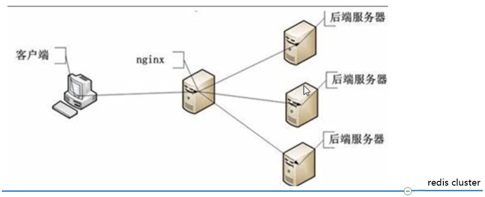

#### 问题一：单机版没有锁

在没有加锁的情况下，并发下商品剩余数不对，出现超卖的现象；

那么我们是应该加Synchronized还是加ReentrantLock还是都可以呢？

其实 Synchronized是java JVM层面的关键字，意味着**不见不散**，线程进来之后 ，如果程序不执行完毕，其他线程无法进入。

Lock lock = new ReentrantLock();

可以使用里面的lock.tryLock();或者lock.tryLock(Time)，到设置时间之后，锁自动释放，下一个线程进行抢占。

解决办法：将代码修改为2.0版本

```java
package com.romanticlei.redis.boot_redis02.controller;

import org.springframework.beans.factory.annotation.Autowired;
import org.springframework.beans.factory.annotation.Value;
import org.springframework.data.redis.core.StringRedisTemplate;
import org.springframework.web.bind.annotation.GetMapping;
import org.springframework.web.bind.annotation.RestController;

@RestController
public class GoodController {

    @Autowired
    private StringRedisTemplate stringRedisTemplate;

    @Value("${server.port}")
    private String serverPort;

    @GetMapping("/buy_goods")
    public String buy_Goods(){
        synchronized (this) {
            String result = stringRedisTemplate.opsForValue().get("goods:001");
            int goodNumber = result == null ? 0 : Integer.parseInt(result);

            if (goodNumber > 0){
                int realNumber = goodNumber - 1;
                stringRedisTemplate.opsForValue().set("goods:001", String.valueOf(realNumber));
                System.out.println("成功买到商品，库存还剩下： " + realNumber + "件" + "\t 服务提供端口" + serverPort);
                return "成功买到商品，库存还剩下： " + realNumber + "件" + "\t 服务提供端口" + serverPort;
            }

            return "商品已经售完"+ "\t 服务提供端口" + serverPort;
        }
    }
}
```

#### 问题二：nginx分布式微服务架构

分布式部署后，单机锁还是出现超卖现象,不管使用的是synchronized还是ReentrantLock都不管用，此时我们需要分布式锁,需要使用redis cluster



nginx配置负载均衡，启动两个微服务 ，开启压力测试，模拟高并发

解决办法：将代码修改为3.0版本，官网：https://redis.io/commands/set

```java
package com.romanticlei.redis.boot_redis01.controller;

import org.springframework.beans.factory.annotation.Autowired;
import org.springframework.beans.factory.annotation.Value;
import org.springframework.data.redis.core.StringRedisTemplate;
import org.springframework.web.bind.annotation.GetMapping;
import org.springframework.web.bind.annotation.RestController;

import java.util.UUID;

@RestController
public class GoodController {

    @Autowired
    private StringRedisTemplate stringRedisTemplate;

    public static String REDIS_LOCK = "romanticlei";

    @Value("${server.port}")
    private String serverPort;

    @GetMapping("/buy_goods")
    public String buy_Goods() {

        String value = UUID.randomUUID().toString() + Thread.currentThread().getName();
        Boolean flag = stringRedisTemplate.opsForValue().setIfAbsent(REDIS_LOCK, value);// 该命令就是redis中的setnx

        if (!flag) {
            return "抢占失败，请重试！";
        }

        String result = stringRedisTemplate.opsForValue().get("goods:001");
        int goodNumber = result == null ? 0 : Integer.parseInt(result);

        if (goodNumber > 0) {
            int realNumber = goodNumber - 1;
            stringRedisTemplate.opsForValue().set("goods:001", String.valueOf(realNumber));
            System.out.println("成功买到商品，库存还剩下： " + realNumber + "件" + "\t 服务提供端口" + serverPort);
            stringRedisTemplate.delete(REDIS_LOCK);
            return "成功买到商品，库存还剩下： " + realNumber + "件" + "\t 服务提供端口" + serverPort;
        }

        return "商品已经售完" + "\t 服务提供端口" + serverPort;
    }

}
```

#### 问题三：上面代码出现异常无法释放锁

上面代码出现异常的话 ，可能无法释放锁，必须要在代码层面finally释放锁

解决办法：加锁解锁，lock/unlock必须同时出现并保证调用，修改代码为4.0

```java
package com.romanticlei.redis.boot_redis01.controller;

import org.springframework.beans.factory.annotation.Autowired;
import org.springframework.beans.factory.annotation.Value;
import org.springframework.data.redis.core.StringRedisTemplate;
import org.springframework.web.bind.annotation.GetMapping;
import org.springframework.web.bind.annotation.RestController;

import java.util.UUID;

@RestController
public class GoodController {

    @Autowired
    private StringRedisTemplate stringRedisTemplate;

    public static String REDIS_LOCK = "romanticlei";

    @Value("${server.port}")
    private String serverPort;

    @GetMapping("/buy_goods")
    public String buy_Goods() {

        String value = UUID.randomUUID().toString() + Thread.currentThread().getName();
        try {
            Boolean flag = stringRedisTemplate.opsForValue().setIfAbsent(REDIS_LOCK, value);// 该命令就是redis中的setnx

            if (!flag) {
                return "抢占失败，请重试！";
            }

            String result = stringRedisTemplate.opsForValue().get("goods:001");
            int goodNumber = result == null ? 0 : Integer.parseInt(result);

            if (goodNumber > 0) {
                int realNumber = goodNumber - 1;
                stringRedisTemplate.opsForValue().set("goods:001", String.valueOf(realNumber));
                System.out.println("成功买到商品，库存还剩下： " + realNumber + "件" + "\t 服务提供端口" + serverPort);
                stringRedisTemplate.delete(REDIS_LOCK);
                return "成功买到商品，库存还剩下： " + realNumber + "件" + "\t 服务提供端口" + serverPort;
            }

            return "商品已经售完" + "\t 服务提供端口" + serverPort;
        } finally {
            stringRedisTemplate.delete(REDIS_LOCK);
        }
    }

}
```


