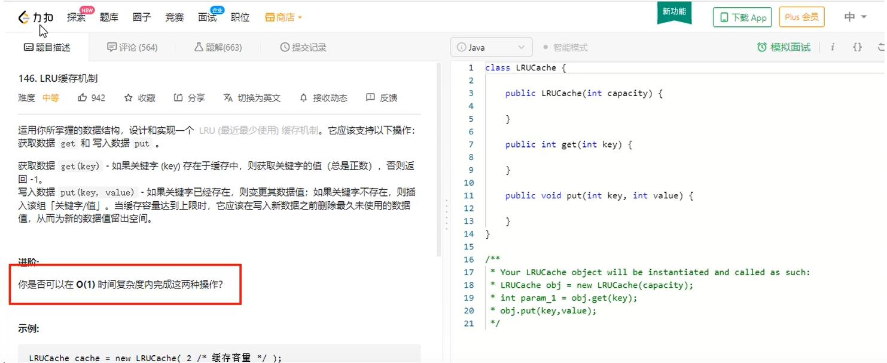

### redis 的 LRU 算法简介

#### redis 的 LRU 了解过吗？可否手写一个LRU算法？ LRU是什么？

LRU是 Least Recently used 的缩写，即最近最少使用，是一种常用的页面置换算法，选择最近最久未使用的数据予以淘汰

#### 算法来源(https://leetcode-cn.com/problems/lru-cache/)

#### 设计思想

1.所谓缓存，必须 要有读+写两个操作，按照命中率的思路考虑，写操作+读操作时间复杂度都需要为O(1)

2.特殊要求

2.1必须要有顺序之分，区分最近使用和很久没有使用的数据排序

2.2写和读操作一次搞定

2.3 如果容量（坑位）满了要删除最不常用的数据，每次新访问还要把新的数据插入到队头（按照业务自己设定左右那一边是队头）

**查找快，插入块，删除快，且还需要先后排序  -------> 什么样的数据结构可以满足这个问题？**

LRU的算法核心是哈希链表，本质就是HashMap + DoubleLinkedList 时间复杂度是O(1)，哈希表 + 双向链表的结合体

