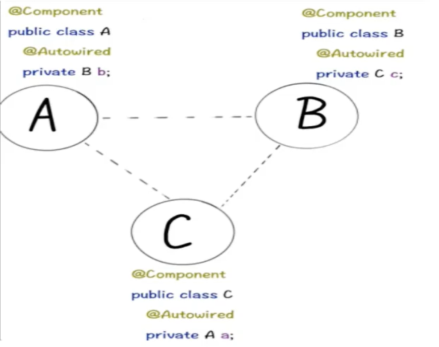

##### 面试题

解释Spring中的三级缓存?

三级缓存分别是什么？三个Map有什么异同？

什么是循环依赖？一般我们说spring容器是什么？

如何检测是否存在循环依赖？实际开发中见过循坏依赖的异常吗？

多例情况下，循环依赖问题为什么无法解决？

#### 什么是循坏依赖

多个bean之间的互相依赖，形成一个闭环；比如A依赖于B，B依赖于C，C依赖于A

```java
public class T1 {

    class A{
        B b;
    }
    class B{
        C c;
    }
    class C{
        A a;
    }
}
 
比如：A依赖于B、B依赖于C、C依赖于A
```

通常来说，如果问Spring容器内部如何解决循环依赖，**一定是指默认的单例Bean中**，属性互相引用的场景



#### 两种注入方式对循环依赖的影响

两种循环方式指的是构造方法注入和get set方法注入。

循环依赖官网说明(https://docs.spring.io/spring-framework/docs/current/reference/html/core.html#beans-dependency-resolution)


**结论**
我们AB循环依赖问题只要A的注入方式是setter且singleton，就不会有循环依赖问题。

#### spring容器循环依赖报错演示BeanCurrentlyCreationException

**构造器方式注入依赖**

ServiceA代码

```java
package com.romanticlei.study.interview.spring.circulardepend.constructorinjection;

import org.springframework.stereotype.Component;

@Component
public class ServiceA {

    private ServiceB serviceB;

    public ServiceA(ServiceB serviceB) {
        this.serviceB = serviceB;
    }
}
```

ServiceB代码

```java
package com.romanticlei.study.interview.spring.circulardepend.constructorinjection;

import org.springframework.stereotype.Component;

@Component
public class ServiceB {

    private ServiceA serviceA;

    public ServiceB(ServiceA serviceA) {
        this.serviceA = serviceA;
    }
}
```

ClientConstructor代码

```java
package com.romanticlei.study.interview.spring.circulardepend.constructorinjection;

public class ClientConstructor {

    public static void main(String[] args) {
  // 无限套娃
        new ServiceA(new ServiceB(new ServiceA(。。。)));
    }
}
```

通过代码可以看出构造器循环依赖是无法解决，你想让构造器注入支持循环依赖，是不存在的只会无限套娃。

**以set方式注入依赖**

ServiceAA

```java
package com.romanticlei.study.interview.spring.circulardepend.setinjection;

import org.springframework.stereotype.Component;

@Component
public class ServiceAA {
    private ServiceBB serviceBB;

    public void setServiceBB(ServiceBB serviceBB) {
        this.serviceBB = serviceBB;
        System.out.println("A 里面设置了 B");
    }
}
```

ServiceBB

```java
package com.romanticlei.study.interview.spring.circulardepend.setinjection;

import org.springframework.stereotype.Component;

@Component
public class ServiceBB {
    private ServiceAA serviceAA;

    public void setServiceAA(ServiceAA serviceAA) {
        this.serviceAA = serviceAA;
        System.out.println("B 里面设置了 A");
    }
}
```

ClientSet

```java
package com.romanticlei.study.interview.spring.circulardepend.setinjection;

public class clientSet {
    public static void main(String[] args) {
        // 创建ServiceAA
        ServiceAA a = new ServiceAA();
        // 创建ServiceBB
        ServiceBB b = new ServiceBB();

        // 将serviceA注入到ServiceB中
        b.setServiceAA(a);
        // 将ServiceB注入到ServiceA中
        a.setServiceBB(b);
    }
}
```

#### 重要code案例演示

code-java 基础

```java
package com.romanticlei.study.interview.spring.circulardepend.javaSE;

public class A {

    private B b;

    public B getB() {
        return b;
    }

    public void setB(B b) {
        this.b = b;
    }

    public A() {
        System.out.println("创建A成功");
    }
}
```

```java
package com.romanticlei.study.interview.spring.circulardepend.javaSE;

public class B {

    private A a;

    public A getA() {
        return a;
    }

    public void setA(A a) {
        this.a = a;
    }

    public B() {
        System.out.println("创建B成功");
    }
}
```

```java
package com.romanticlei.study.interview.spring.circulardepend.javaSE;

public class ClientCode {

    public static void main(String[] args) {
        A a = new A();
        B b = new B();

        a.setB(b);
        b.setA(a);
    }
}
```

Spring 容器

默认的单例(singleton)的场景是支持循环依赖的，不报错，上面的代码会正常打印；创建A成功 创建B成功

原型(Prototype)的场景是不支持循环依赖的，会报错；

```java
创建A成功
创建B成功
Caused by: org.springframework.beans.factory.BeanCurrentlyInCreationException: Error creating bean with name 'a': Requested bean is currently in creation: Is there an unresolvable circular reference?
   at org.springframework.beans.factory.support.AbstractBeanFactory.doGetBean(AbstractBeanFactory.java:268)
   at org.springframework.beans.factory.support.AbstractBeanFactory.getBean(AbstractBeanFactory.java:202)
   at org.springframework.beans.factory.support.BeanDefinitionValueResolver.resolveReference(BeanDefinitionValueResolver.java:330)
   ... 17 more
```

操作步骤

applicationContext.xml

```xml
<?xml version="1.0" encoding="UTF-8"?>
<beans xmlns="http://www.springframework.org/schema/beans"
       xmlns:xsi="http://www.w3.org/2001/XMLSchema-instance" xml:lang=""
       xsi:schemaLocation="http://www.springframework.org/schema/beans http://www.springframework.org/schema/beans/spring-beans.xsd">

    <!-- 默认为单例模式，循环依赖创建成功-->
    <!--<bean id="a" class="com.romanticlei.study.interview.spring.circulardepend.javaSE.A">
        <property name="b" ref="b"/>
    </bean>

    <bean id="b" class="com.romanticlei.study.interview.spring.circulardepend.javaSE.B">
        <property name="a" ref="a"/>
    </bean>-->

    <!-- 原型模式，循环依赖创建失败-->
    <bean id="a" class="com.romanticlei.study.interview.spring.circulardepend.javaSE.A" scope="prototype">
        <property name="b" ref="b"/>
    </bean>

    <bean id="b" class="com.romanticlei.study.interview.spring.circulardepend.javaSE.B" scope="prototype">
        <property name="a" ref="a"/>
    </bean>
</beans>
```

默认单例，修改为原型scope="prototype",并且新建一个启动方法，读取xml文件

```java
package com.romanticlei.study.interview.spring.circulardepend.javaSE;

import org.springframework.context.ApplicationContext;
import org.springframework.context.support.ClassPathXmlApplicationContext;

public class ClientSpringContainer {

    public static void main(String[] args) {
        ApplicationContext context = new ClassPathXmlApplicationContext("applicationContext.xml");

        A a = context.getBean("a", A.class);
        B b = context.getBean("b", B.class);
    }
}
```

循环依赖异常


#### 重要结论(Spring内部通过3级缓存来解决循环依赖)

DefaultSingletonBeanRegistry

只有单例的bean会通过三级缓存提前暴露来解决循环依赖的问题，而非单例的bean，每次从容器中获取一个新的对象，都会重新创建，所以非单例的bean是没有缓存的，不会将其放到三级缓存中。

第一级缓存（也叫单例池）singletonObjects：存放已经经历了完整声明周期的Bean对象

第二级缓存 earlySingletonObjects：存放早期暴露出来的Bean对象，Bean的生命周期未结束（属性还未填充完毕）

第三级缓存 Map<String, Object<?>> singletonFactories，存放可以生成Bean的工厂

