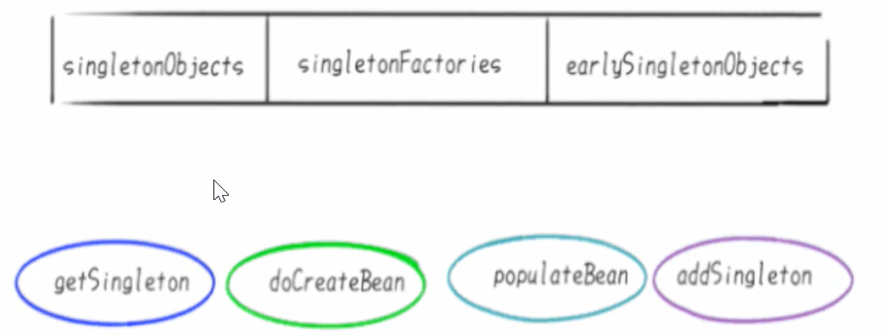
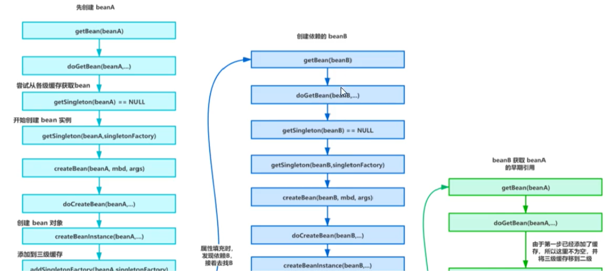
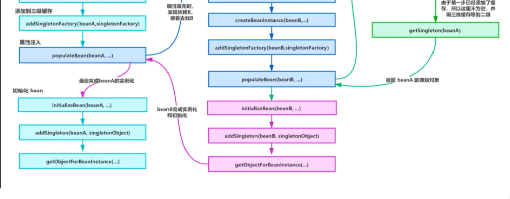

实例化/初始化

实例化：内存中申请一块内存空间，好似租赁一房子，自己的家具东西都还没有搬家进去。

初始化属性填充：完成属性的各种赋值，好似装修、家电家具进场。

#### 3个Map和四大方法，总体相关对象



第一层 singletonObjects 存放的是已经初始化好了的Bean，

第二层 earlySingletonObjects 存放的是实例化了，但未初始化的Bean，

第三层singletonFactories存放的是FactoryBean。假如A类实现了FactoryBean，那么依赖注入的时候不是A类，而是A类产生的Bean。


#### A/B两对象在三级缓存中的迁移说明

1. A创建过程中需要B，于是A将自己放到三级缓存里面，去实例化B
2. B实例化的时候发现需要A，于是B先去一级缓存查找，没有，再去二级缓存查，还是没有，在查三级缓存，找到了A然后把三级缓存里面的这个A放到二级缓存里面，并删除三级缓存里面的A
3. B顺利初始化完成，将自己放到一级缓存里面（此时B里面的A是创建中状态），然后回来接着创建A，此时B已经创建结束，直接从一级缓存里面拿B，然后完成创建，并将A自己放到一级缓存里面。


全部Debug断点


创建循环依赖时，程序在加载xml文件时，我们会调用this.refresh();方法

--> 在this.refresh();方法里面调用this.finishBeanFactoryInitialization(beanFactory);方法

--> beanFactory.preInstantiateSingletons();

--> this.getBean(beanName);

--> doGetBean(String name, Class<T> requiredType, final Object[] args, boolean typeCheckOnly)

--> 然后初始化创建bean A，控制台会打印出创建A成功的输出（前提是我们在A方法的无偿构造器中有输出语句）

--> addSingletonFactory(String beanName, ObjectFactory<?> singletonFactory);调用此方法将bean A放入到三级缓存中

```java
protected void addSingletonFactory(String beanName, ObjectFactory<?> singletonFactory) {
    Assert.notNull(singletonFactory, "Singleton factory must not be null");
    synchronized(this.singletonObjects) {
        if (!this.singletonObjects.containsKey(beanName)) {
            this.singletonFactories.put(beanName, singletonFactory);
            this.earlySingletonObjects.remove(beanName);
            this.registeredSingletons.add(beanName);
        }
    }
}
```

--> populateBean(String beanName, RootBeanDefinition mbd, BeanWrapper bw); bean A初步完成

--> 相同的步骤，程序在回来创建bean B，并把bean B放到三级缓存中

--> bean B 放入三级缓存之后，bean A又回来调用getSingleton(String beanName, boolean allowEarlyReference)；方法，将自己放入到二级缓存，并将自己从三级缓存中移除

--> 然后又回来创建bean B，调用addSingleton(String beanName, Object singletonObject) ;方法，直接将自己放到一级缓存里面，同时从三级缓存中移除，不用放入到二级缓存，此时的bean B已经算创建完成。

--> 现在又回过头来创建bean A，调用addSingleton(String beanName, Object singletonObject) ;方法，将bean A从二级缓存移动到一级缓存中，同时从二级缓存中移除。


总结Spring是如何解决循环依赖的

- Spring创建bean主要分为两个步骤，创建原始bean对象，接着去填充对象属性和初始化
- 每次创建bean之前，我们都会从缓存中查下有没有该bean，因为是单例，只能有一个
- 当我们创建bean A的原始对象后，并把它放到三级缓存中，接下来就该填充对象属性，这时候发现依赖了bean B，接着就又去创建bean B，同样的流程，创建完bean B填充属性时发现它依赖了bean A又是同样的流程，
  **不同的是：**
  这时候可以在三级缓存中查找到刚好放进去的原始对象bean A，所以不需要继续创建，用它注入bean B，完成bean B的创建。
- 既然bean B创建好了，所以bean A就可以完成填充属性的步骤了，接着执行剩下的逻辑，闭环完成。

```java
protected Object getSingleton(String beanName, boolean allowEarlyReference) {
    // 从 singletonObjects 获取实例，singletonObjects 中的实例都是准备好的 bean 实例，可以直接使用
    Object singletonObject = this.singletonObjects.get(beanName);
    // isSingletonCurrentlyInCreation(beanName) 判断当前单例 bean 是否正在创建中
    if (singletonObject == null && this.isSingletonCurrentlyInCreation(beanName)) {
        synchronized(this.singletonObjects) {
            // 一级缓存没有，就去二级缓存里面查找
            singletonObject = this.earlySingletonObjects.get(beanName);
            if (singletonObject == null && allowEarlyReference) {
                // 二级缓存没有，就去三级缓存里面查找
                ObjectFactory<?> singletonFactory = (ObjectFactory)this.singletonFactories.get(beanName);
                if (singletonFactory != null) {
                    // 三级缓存中存在的话，就将其移动到二级缓存
                    singletonObject = singletonFactory.getObject();
                    this.earlySingletonObjects.put(beanName, singletonObject);
                    this.singletonFactories.remove(beanName);
                }
            }
        }
    }

    return singletonObject != NULL_OBJECT ? singletonObject : null;
}
```


Spring 解决循环依赖依靠的是Bean的"中间态"这个概念，而这个中间态指的是已经实例化但是还没有初始化的状态----->半成品。
实例化的过程又是通过构造器创建的，如果A还没创建好，怎么可能提前曝光，所以构造器的循环依赖无法解决。

Spring为了解决单例的循环依赖问题，使用了三级缓存。
其中一级缓存为单例池（singletonObjects）
二级缓存为提前曝光对象（earlySingletonObjects）
三级缓存为提前曝光对象工厂（singletonFactories）

假设A、B循环引用，实例化A的时候就将其放入三级缓存中，接着填充属性的时候，发现依赖了B，同样的流程也是实例化后放入三级缓存，按着去填充属性时又发现自己依赖A，这时候从缓存中查找到早期暴露的A，没有AOP代理的话，直接将A的原始对象注入B， 完成B 的初始化后，进行属性填充和初始化，这时候B完成后，就去完成剩下的A的步骤，如果有AOP代理，就进行AOP处理获取代理后的对象A，注入B，走剩下的流程。


#### Debug  -> Spring解决循环依赖的过程





1. 调用doGetBean()方法，想要获取bean A，于是调用getSingleton()方法从缓存中查找bean A
2. 在getSingleton()方法中，从一级缓存中查找，没有，返回null
3. doGetBean()方法中获取到的bean A为null，于是走对应的处理逻辑，调用getSingleton()重载方法(参数为ObjectFactory)
4. 在getSingleton()方法中，先将bean A_name添加到一个集合中，用于标记该bean正在创建中，然后回调匿名内部类的createBean方法
5. 进入AbstractAutowireCapableBeanFactory#doCreate，先反射调用构造器创建出bean A的实例，然后判断，是否为单例，是否允许提前暴露引用(对于单例一般为true)、是否正在创建(即是否在第四步的集合中)。判断为true则将bean A添加到【三级缓存】中
6. 对bean A进行属性填充，此时检测到bean A依赖bean B，于是开始查找bean B
7. 调用doGetBean()方法，和上面bean A的过程一样，到缓存中查找bean B，没有则创建，然后给bean B填充属性
8. 此时bean B依赖于bean A，调用getSingleton()获取bean A，依次从一级、二级、三级缓存中找，此时从三级缓存中获取到bean A的创建工厂，通过创建工厂获取到 singletonObject，此时 singletonObject 指向的就是上面在doCreateBean()方法中实例化的bean A
9. 这样bean B就获取到了bean A的依赖，于是bean B顺利完成实例化，并将bean A从三级缓存移动到二级缓存中
10. 随后bean A继续他的属性填充工作，此时也获取到了bean B，bean A也随之完成了创建，回到getSingleton()方法中继续向下执行，将bean A从二级缓存移动到一级缓存中

